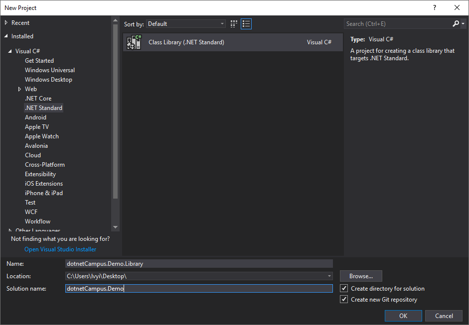

# 入门

源码包的使用分为两个部分：

1. 源码包打包
1. 安装和使用源码包

## 源码包打包

我们现在从零开始创建一个项目，然后将其打包成源码包。

### 第一步：新建一个项目，或者打开现有项目

创建项目是 Visual Studio 开发的必备步骤，所以这里只做简单描述。



在项目中，我们只新建一个简单的类型 `Foo` 用来演示：

```csharp
using System;

namespace dotnetCampus.Demo.Library
{
    /// <summary>
    /// This class is packaged as a source reference so it will be compiled into your own project.
    /// </summary>
    public class Foo
    {
        /// <summary>
        /// Print hello to the specifed <paramref name="name"/>.
        /// </summary>
        /// <param name="name">The name which <see cref="Foo"/> will say hello to.</param>
        public void PrintHello(string name)
        {
            Console.WriteLine($"Hello {name}");
        }
    }
}
```

项目中其实也只有这一个类而已：

```
- Solution "dotnetCa"
```

## 安装和使用源码包

占位符
